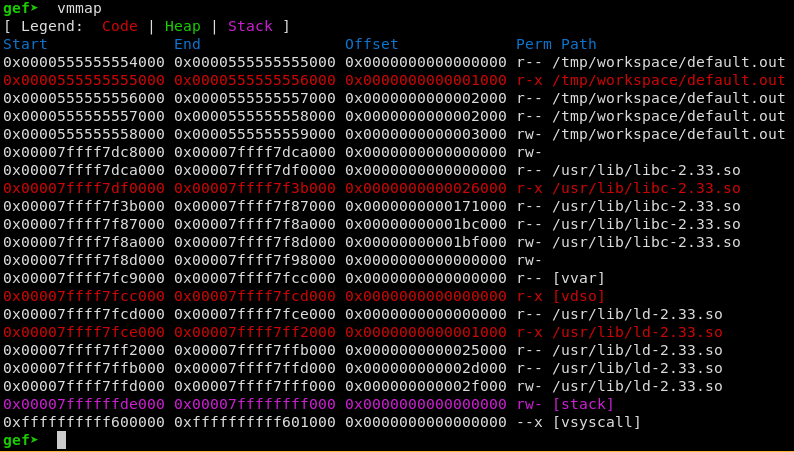

this challenge was the first one with over 100 points so i got serious . m0ngi got rid of the win function so we'll have to pop our own shell . 
lets look up at the challenge in IDA . 

     
    

we see that the program offers two functionalities : 
    * read 0x12c=300 bytes int buf variable when its declared size is 264 . you guessed it right . Buffer overflow 
    * the v4(v6) line : what is does basically is it executes the function pointed by v4 with v6 as parameter . v4 is the pointer not the sellcode.

notice that with the buffer overflow we can overflow both v4 and v6 so we can everytime we enter the loop we can execute whatever we want with a first parameter of our choosing . 

we could overwrite v4 with an adress to system or execv if we we could and v6 to a pointer that points to '/bin/sh' string if we could but not with what we have now . 

its time to rely on libc (the attaque name is ret2libc if you wanna read more about it) . Well in most of the cases , and decided in compilation by the user , the program includes a huge library called libc and it contains everything you can dream of , including endless functions like system and strings like '/bin/sh' . 

But the libc is not loaded in the same address . and if we could know where libc is loaded , its just GG . we get the location of system and string '/bin/sh' within libc and put them in v4 and v6 to execute(system('/bin/sh')). 
how could we leak it ? well we can call puts as we have its location as shown in picture and we can pass as argument a pointer that we will point to a lcoation within libc in execution time . one of those is the 0x404018 when we disas puts before exection . that address -in brief- is called got entry and every function that ends @plt has one .the value that it has is the location of that function the libc . so if we pass puts(0x404018) it will print whatever is in 0x404018 and its the puts libc function in this example . i ended up using the read entry from read@plt .

once we do that we write a few python lines that greps whatever the puts prints , transfer it into hex and then calculate the libc base address . 

with this done , you could run your exploit locally and pop a shell . However remotely it wont be possible as the libc version that the server uses will be different , which means different offsets >>> different calculations . so we need to base our calculations on the libc file the challenge provided . 
Another thing to mention , why did i put those sleep(0.1) between every sendline ? idk either but it didnt work without it . maybe has something to do with server response time . 
i'd encourage you to look some more in depth ret2libc tutorials as i cant explain everything in my script in this writeup . 

