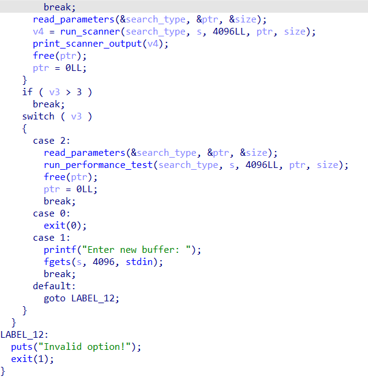
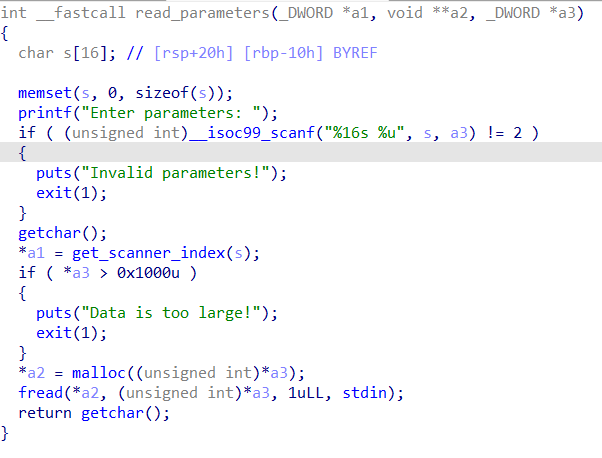

this challenge is about a scanner that scans if a string you provide is a substring of another string you provide . the challenge provided you with 3 scanner options but whatever because they all got the same bug . i will assume you gave the challenge a try and go straight forward to it . 
the bug is that we can make it so that it finds a string outside of the string we provided . lets suppose this the large string **aaaaaaaab**,
if we make it look for the substring **bxxxxx** , it will look for the remaining **xxxxx** outside of the **aaaaaaaab**. 
so what this means we can brute force character by character the heap value (we need to guess it right to brute force the values after) and after that the libc value . 

### Code execution : 

our main function has no ret instruction , we cant even overflow to begin with . 

see that **__isoc99_scanf("%16s %u", s, a3)** ? our buffer is 16 bytes is 16 bytes long so what's the matter ? well , scanf always adds a null byte to the end of string , so if we make it read 16 bytes it will write a null byte to the rbp . thats the beginning of the end . 
with that we managed to make rbp a bit lower value . then what ? we still cant make any overflow , right ? 

## final stage : 
let me explain whats gonna happen with an example . in normal conditions : **rbp=0x11050** (for example) and **rsp=rbp-0x1010=10040** because thats the stack frame . when we call fgets to read in the buffer at **rbp-0x0x1010=10040**, the ret adress should be at **0x10038** hence there is no way we can overwrite it because our buffer is below it . 
lets remake our calcualtion but with **rbp=0x11000** (we nulled out its first byte) and rsp is still the same **rsp=0x10040** . our ret adress is at **0x10038** but now our buffer is at **rbp-0x1010=0xfff0** and just like that we can overflow the ret address . and place our ropchain . 

well it wouldn't be that easy right ? yeah youre right because although our binary doesnt implement stack canaries , some of the libc function do . one of them is fgets . so we need our **rbp-0x1010** to be below where the canaries . the only wayi can think we can get it done with is brute force because altough the chances are slim it's still possible . 

my script worked fine(took some time though) locally and i could pop a shell  which couldnt happen due to my dear internet (char by char brute force + actual brute force which means 255 * 16 * 16 iterations which is heavy for a remote connection)

hope you picked up a thing or two from this writeup ❤️️

