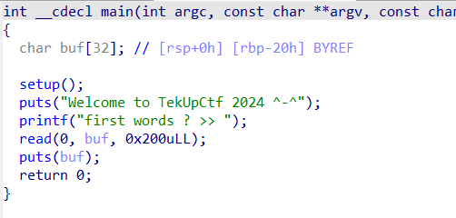

this one is also a quick and cool ROP challenge , ressembles retr0GPT in some ways . 

checksec:




the binary asks for input (with obvious stack overflow) then prints it back to us . notice that our input is not **null terminated** , so we can actually leak existing values on the stack with puts . one thing to mention is if you want to leak a value then you shoudlnt overwrite it , and also you shoudlnt send any null byte before it , so if you plan on sending a gadget to restart the program or redirecting control flow , you wont be able to leak , so you can only choose one thing to do !!! **leak** or **restart** , the blue or the red pill . 


in order to pop shell , we need to do both , because no enough gadgets in our binary . there is one way actually to achieve that .
remember that **__libc_start_main** -which is a libc function- is the function that called main , so the ret address of main is a value of __libc_start_main . so what if we modifie the first bytes (the first byte to be precise) so that it will recall main and at the same time keep its value uncorrupted (it's a libc value dont forget) so we can leak it . 


you see our return address is at ```0x00007ffff7c23a90 == __libc_start_call_main+128``` , we need to make it jump backwards . so we overwrite the first 0x90 with 0x30 -for example- . now lets a figure out where to actually return so that the program restarts, here i just brute forced , as there isnt much guessing , 
and i got for which values the program successully restarts (the brute force script is commented down in my solver) . 

from there we overflow again but now with our ```system("/bin/sh")``` ROP . 

kudos to retr0 for the awesome challenges .  